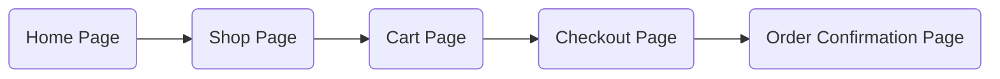

# k6 WooCommerce

## Introduction

Forked from https://github.com/grafana/k6-example-woocommerce

This repo contains k6 scripts that interacting with a basic WooCommerce website hosted wherever you see fit. You'll need to pass in your hostname as an environmental variable when running k6.

The scripts have been modularized so that each distinct "user action" manifests as its own source file, intended to be used from the entry script, in this case `main.js`. Doing so promotes code reuse and maintainability, as well as catering for some degree of flexibility over the order in which the scripts should run. Obviously, products need to have been added to the cart before checkout can be completed successfully, so there is some sequence that needs to be maintained for them to work as expected.

## Usage

1. Install [k6](https://k6.io) (instructions [here](https://k6.io/docs/getting-started/installation/))
2. Clone the repo
3. Navigate to the directory and `k6 run -e HOSTNAME=your_website_name_here main.js` (make sure k6 is on your PATH)

## Contents

The scripts, and their suggested order, are as follows:

### `main.js`

The entry script, where k6 `options` would be set, and the script called as part of `k6 run` (see Usage below). Its `export default function` determines what the VUs will run.
All variables that drive the tests live here.

### `utils.js`

This utility script contains a single exported function `checkStatus` that can be used to verify HTTP status codes. Should the received status code be different from the expected one, a couple of booleans determine whether to print the `Response.body` (if available) and whether to `fail` (skip) the rest of the iteration.

### `navigateHomepage.js`

Naturally the first script to be executed. A user will usually browse your home page first.

### `navigateShop.js`

The very next page to be hit which lists the available products on the site.
By default, only the first product in the list is selected. See [Emulating user randomness](#Emulating-user-randomness) for uhm, randomness.

### `addToCart.js`

Uses (and depends on) the static or randomly-selected product extracted in `navigateShop.js`. An enhancement here might be to make all products available to it (perhaps as input data via the function parameters), such that multiple products can be added instead of just a single one.

### `navigateToCart.js`

The equivalent of the user clicking "View Cart".

### `navigateToCheckout.js`

Aside from proceeding to checkout, there are also two dynamic values that need to be extracted from the response and used in the subsequent checkout itself.

### `updateAddress.js`

This script represents an AJAX call that takes place when the user enters their address prior to checkout.

The final checkout of the cart. A `result: "success"` JSON value is expected in the response, and so a `check` ensures that is the case. The JSON is also expected to contain a `redirectUrl` that takes the user to the confirmation page.

### `refreshCart.js`

Simply refreshes the page.

## Emulating user randomness

If you want less predictability (not every user would buy the same thing!):

Comment IN `globalThis.vars["selectedProduct"]` under `select a random product and store in vars:`

and then:

Comment OUT `globalThis.vars["selectedProduct"]` under `select the first product and store in vars:`

Furthermore, comment IN the 2 lines under `global min/max sleep durations (in seconds):` in `main.js`

and

Every line `sleep(randomIntBetween(pauseMin, pauseMax));` in every file (can be found at the bottom of each - apart from `main.js` and `utils.js`).

## How to set up your WooCommerce site

Basic layout of the store that this k6 test runs through.

Make sure you set the following up on your WooCommerce store plugin:

- Permalink structure > Post Name
- Product Permalink > Shop base with category
- COD only for payments
- Enable Guest Checkout
- Product Catalog > Shop page display > Show products
- Disable all email notifications (shop and customer)

** Tested on:
Theme: Storefront version 4.6.1
WordPress version: 6.8.1
WooCommerce version: 9.9.5
PHP version: 8.3.22
MySQL version: 10.11.11-MariaDB-deb11
HTTPS: no

## Changelog from forked repo

- Made site name an ENV var
- Moved customer details to Global vars (main.js)
- Added random name generator for fun
- Replaced submitCheckout.js for refreshCart.js
- Added static product selection option to navigateShop.js
- Fixed nonce extraction
- Updated form submission for WooCommerce use of wp-blocks
- Fixed some of the jquery lookups for HTTP response
- Moved checkout success to updateAddress.js